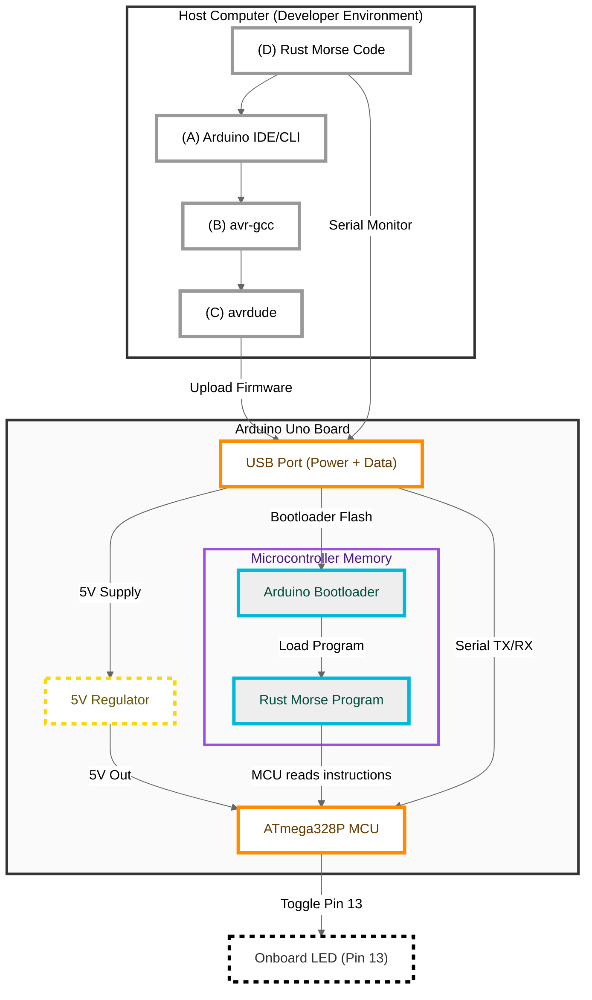

# Rust Arduino "Hello World"

This repository contains a minimal Rust application targeting the Arduino Uno (ATmega328P) that blinks an LED to spell out "HELLO WORLD" in Morse code. It can serve both as a **boilerplate** or **template** for experienced developers using [arduino-hal](https://github.com/Rahix/avr-hal/tree/main/arduino-hal) and an **educational resource** for students or self-taught learners exploring Rust in embedded systems.

---

## Table of Contents

1. [Overview](#overview)
2. [Features](#features)
3. [System Architecture Diagram](#system-architecture-diagram)
4. [Requirements](#requirements)
5. [Project Structure](#project-structure)
6. [Getting Started](#getting-started)
   - [1. Clone the Repository](#1-clone-the-repository)
   - [2. Install Rust AVR Toolchain](#2-install-rust-avr-toolchain)
   - [3. Install AVR Tools](#3-install-avr-tools)
   - [4. Configure Cargo for AVR](#4-configure-cargo-for-avr)
   - [5. Connect Your Arduino Uno](#5-connect-your-arduino-uno)
   - [6. Build and Flash](#6-build-and-flash)
7. [Usage & Customization](#usage--customization)
8. [Troubleshooting](#troubleshooting)
9. [Contributing](#contributing)
10. [License](#license)
11. [Credits & References](#credits--references)

---

## Overview

- **What it Does**
  This project demonstrates a simple "Hello World" by blinking the Arduino Uno's onboard LED (pin 13) in Morse code. It's an excellent starting point for beginners who want to explore Rust on microcontrollers, as well as a practical foundation for engineers adopting Rust for embedded projects.

- **Why Rust?**
  Rust offers strong memory safety and high performance, making it well-suited for embedded development. With the [`arduino-hal`](https://crates.io/crates/arduino-hal) crate, you can write safe, high-level Rust code that compiles down to efficient AVR machine code.

---

## Features

- **Morse Code Blink**: Blinks the message "HELLO WORLD."
- **Boilerplate/Template Setup**: Demonstrates a basic Rust project structure targeting AVR.
- **Easy/Configurable Toolchain**: Simplifies setup with a pre-configured `.cargo/config.toml`.
- **Commented & Readable Source Code**: Teaches core concepts like timing, pin manipulation, and Morse encoding.

---

## System Architecture Diagram



---

## Requirements

1. **Arduino Uno** or compatible ATmega328P-based board.
2. **Rust Toolchain** with AVR support:
   - `rustup` installed
   - AVR GNU toolchain (e.g., `gcc-avr`, `binutils-avr`, `avr-libc`, [WinAVR](http://winavr.sourceforge.net/) on Windows)
3. **USB Cable** to connect your Arduino Uno to your development machine.
4. **`avrdude`** for uploading firmware to the board.

---

## Project Structure

```plaintext
rust-arduino-morse/
├── Cargo.toml       # Project manifest with dependencies (e.g., arduino-hal, panic-halt)
├── src
│   └── main.rs      # The Rust Morse code blink program
├── .cargo
│   └── config.toml  # AVR target configuration for Cargo
└── README.md        # Project documentation (this file)
```

- **`Cargo.toml`**: Declares project dependencies and metadata.
- **`src/main.rs`**: The entry point of the application containing the Morse blink logic.
- **`.cargo/config.toml`**: Tells Cargo to build for `avr-atmega328p` and run `avrdude` automatically on `cargo run`.

---

## Getting Started

### 1. Clone the Repository

```bash
git clone https://github.com/your-username/rust-arduino-morse.git
cd rust-arduino-morse
```

### 2. Install Rust AVR Toolchain

1. Install Rust if you haven't already:
   ```bash
   curl --proto '=https' --tlsv1.2 -sSf https://sh.rustup.rs | sh
   ```

2. Add the AVR target:
   ```bash
   rustup target add avr-atmega328p
   ```

3. Install nightly Rust (required for AVR support):
   ```bash
   rustup toolchain install nightly
   rustup default nightly
   ```

### 3. Install AVR Tools

**Linux**:
```bash
sudo apt-get update
sudo apt-get install gcc-avr binutils-avr avr-libc avrdude
```

**Mac**:
```bash
brew tap osx-cross/avr
brew install avr-gcc avrdude
```

**Windows**:
1. Install [WinAVR](http://winavr.sourceforge.net/)
2. Add WinAVR's bin directory to your PATH

### 4. Configure Cargo for AVR

1. Create or update `.cargo/config.toml`:
   ```toml
   [build]
   target = "avr-atmega328p"

   [target.'cfg(target_arch = "avr")']
   runner = "avrdude -c arduino -p atmega328p -P /dev/ttyACM0 -b 115200 -D -U flash:w:target/avr-atmega328p/debug/rust-arduino-morse.elf"
   ```

2. Update the port (`-P` parameter) to match your system:
   - Linux: `/dev/ttyACM0` or `/dev/ttyUSB0`
   - Windows: `COM3` (check Device Manager)
   - Mac: `/dev/cu.usbmodem*`

### 5. Connect Your Arduino Uno

1. Plug in your Arduino Uno via USB
2. Ensure the Arduino IDE is closed (it can interfere with the port)
3. Identify your device's serial port:
   - Linux: `ls /dev/tty*`
   - Windows: Check Device Manager
   - Mac: `ls /dev/cu.*`

### 6. Build and Flash

1. Build the project:
   ```bash
   cargo build
   ```

2. Flash to your Arduino:
   ```bash
   cargo run
   ```

3. If flashing fails:
   - Press the reset button on the Arduino just before running `cargo run`
   - Double-check your port in `.cargo/config.toml`
   - Ensure you have the correct permissions (Linux/Mac):
     ```bash
     sudo usermod -a -G dialout $USER
     # Then log out and back in
     ```

---

## Usage & Customization

1. **Morse Pattern**
   - Modify the patterns in [`src/main.rs`](src/main.rs) to change the message being blinked or adjust the timing constants.

2. **Adjust Timing & Pins**
   - In `main.rs`, you can adjust the dot/dash duration or switch to a different LED pin for custom hardware setups.

3. **Debugging with Serial**
   - You can enable serial debugging via `arduino-hal`, though the AVR's resources are limited. See the [arduino-hal documentation](https://docs.rs/arduino-hal/latest/arduino_hal/) for details.

4. **Other Arduino Boards**
   - If you use a different variant (Leonardo, Mega, etc.), update the `-p` parameter in your `.cargo/config.toml` and any bootloader settings accordingly.

---

## Troubleshooting

1. **Permission Denied (Linux)**
   - Add your user to the `dialout` or `uucp` group:
     ```bash
     sudo usermod -a -G dialout $USER
     ```
   - Log out and log back in.

2. **Port/Device Issues**
   - Make sure `.cargo/config.toml` uses the correct serial port (e.g., `/dev/ttyACM0`, `COM3`).

3. **Flashing Failure**
   - Confirm the correct baud rate (`-b 115200`).
   - Press the reset button on the Arduino just before running `cargo run` if you have bootloader timing issues.

4. **Compiler/Crate Updates**
   - If dependencies are out of date, run:
     ```bash
     cargo update
     ```

---

## Contributing

Contributions are welcome! To contribute:

1. Fork this repository.
2. Create a feature branch:
   ```bash
   git checkout -b feature/my-feature
   ```
3. Commit your changes:
   ```bash
   git commit -am 'Add new feature'
   ```
4. Push to your branch:
   ```bash
   git push origin feature/my-feature
   ```
5. Open a Pull Request on GitHub.

---

## License

This project is licensed under the [MIT License](LICENSE). You're free to use, modify, and distribute this code as long as you retain the original license.

---

## Credits & References

- [arduino-hal](https://github.com/Rahix/avr-hal/tree/main/arduino-hal) & [avr-hal](https://github.com/Rahix/avr-hal)
- [Rust Embedded Book](https://docs.rust-embedded.org/)
- [Morse Code Reference](https://en.wikipedia.org/wiki/Morse_code)

**Thank you for using and contributing to this Rust Arduino Morse Blink project!**
