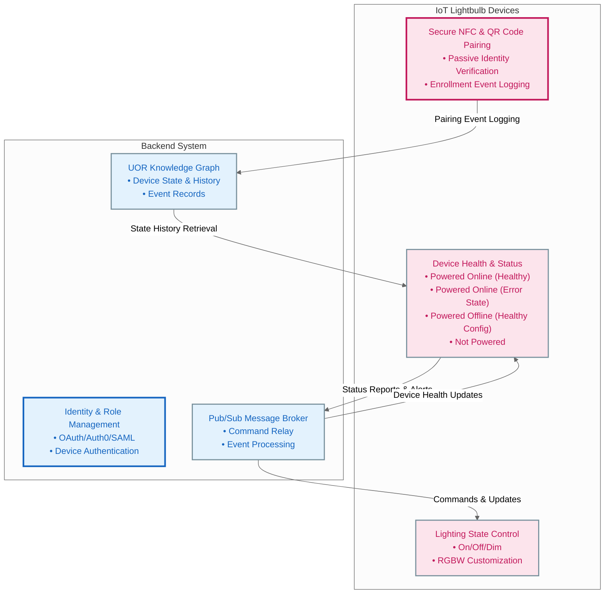

# MVP: IoT Lightbulb Device and Backend System

## Objective
This document outlines the MVP (Minimum Viable Product) requirements for the IoT lightbulb device and backend system. The app and user interface components will be developed later. The MVP focuses on establishing a functional device-to-backend architecture that supports core functionalities.

---

## Gherkin User Stories

### **Device User Stories**

#### **Feature: Device Health and Status**
```gherkin
Feature: IoT Lightbulb Device Health and Status Management

  Scenario: Report device health status to the backend
    Given the IoT lightbulb is powered on
    When the device establishes a connection with the backend
    Then the device should send a "healthy" status update to the backend
    And include its unique device identifier and timestamp

  Scenario: Handle error state
    Given the IoT lightbulb encounters a configuration error
    When the device attempts to sync with the backend
    Then it should send an "error" status update to the backend
    And provide diagnostic information for troubleshooting
```

#### **Feature: Device Pairing and Enrollment**
```gherkin
Feature: IoT Lightbulb Pairing and Enrollment

  Scenario: Secure NFC and QR code-based pairing
    Given a new IoT lightbulb device
    When the user scans the QR code or taps the NFC tag
    Then the device should generate a secure pairing key
    And transmit it to the backend for enrollment
    And the backend should store the pairing event record
```

#### **Feature: Lighting State Control**
```gherkin
Feature: Lighting State Management

  Scenario: Update lighting state via backend commands
    Given the IoT lightbulb is connected to the backend
    When the backend sends a command to set brightness to 50%
    Then the device should adjust its brightness to 50%
    And confirm the state change with the backend

  Scenario: Restore last known state on power cycle
    Given the IoT lightbulb has been powered off
    When the device is powered back on
    Then it should retrieve its last known state from the backend
    And restore the lighting configuration
```

---

### **Backend User Stories**

#### **Feature: Device State and History Management**
```gherkin
Feature: Backend Device State Management

  Scenario: Store device state updates
    Given an IoT lightbulb sends a status update
    When the backend receives the update
    Then the backend should record the device state and timestamp in the knowledge graph

  Scenario: Provide device history logs
    Given a request for device history logs
    When the backend queries the knowledge graph
    Then it should return the state changes and timestamps for the requested device
```

#### **Feature: Identity and Role Management**
```gherkin
Feature: Backend Identity and Role Management

  Scenario: Authenticate device connections
    Given an IoT lightbulb attempts to connect
    When the backend validates the device credentials
    Then the backend should authenticate the connection
    And grant access based on the device identity
```

#### **Feature: Pub/Sub Messaging**
```gherkin
Feature: Backend Pub/Sub Messaging System

  Scenario: Relay commands to IoT devices
    Given the backend receives a command to adjust lighting
    When the Pub/Sub messaging system processes the command
    Then it should relay the command to the appropriate IoT lightbulb

  Scenario: Broadcast firmware updates
    Given a new firmware version is available
    When the backend schedules an update
    Then it should broadcast the firmware update to all connected IoT devices
```

---

## Architecture Diagram


---

## Development Scope

### Device Features
- **Health Reporting:** Basic status reporting (healthy, error, offline).
- **Pairing:** Secure NFC and QR code-based pairing.
- **Lighting Control:** On/Off, brightness adjustment, RGBW customization.
- **State Restoration:** Retrieve and apply the last known state after power cycling.

### Backend Features
- **Device Authentication:** Securely authenticate and manage device connections.
- **Knowledge Graph Integration:** Store and query device states, pairing events, and command logs.
- **Pub/Sub Messaging:** Enable real-time communication between devices and the backend.

---

## Conclusion
This MVP defines the foundational functionality required to establish the IoT lightbulb device and backend system. It provides a minimal yet extensible baseline for future enhancements, including app integration and advanced AI-driven features.

