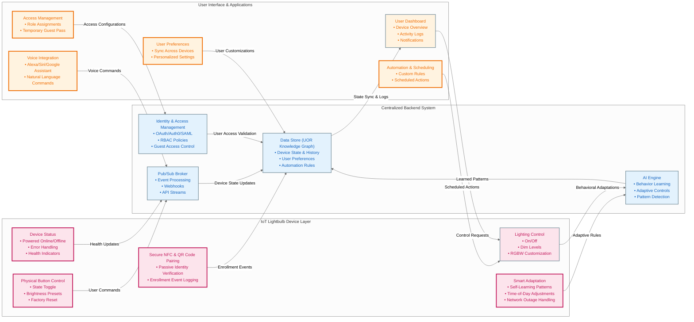

# IoT Lightbulb System Architecture

## **Introduction**

The IoT Lightbulb project is an open-source, cloud-native system designed to provide intelligent, scalable, and secure IoT device management. It enables seamless integration of smart lighting into home automation, industrial control, and fleet management applications, prioritizing user experience, security, and operational resilience.

## **Project Goals and Vision**

The IoT Lightbulb system is designed with the following key principles:

1. **Scalability** – Supports deployments ranging from small home networks to large-scale enterprise and industrial IoT ecosystems.
2. **Modularity** – Adopts a component-based microservices architecture that enables extensibility and seamless integration with third-party platforms.
3. **Security and Compliance** – Implements strong authentication mechanisms, including OAuth, RBAC policies, and compliance frameworks to ensure data integrity and access control.
4. **User Experience** – Delivers an intuitive interface with powerful automation tools that simplify lighting control and customization.
5. **Enterprise and Open-Source Adoption** – Aligns with cloud-native best practices to facilitate open-source contributions and commercial adoption at scale.
6. **Reliability and Redundancy** – Ensures high availability through network fault tolerance, message queue buffering, and local device autonomy.

## **System Architecture Overview**

### **Pub/Sub and Centralized State Architecture**

The IoT Lightbulb system employs a **Publish/Subscribe (Pub/Sub) model combined with Centralized State Management** to enable real-time, event-driven communication between IoT devices, backend services, and user applications.

This model offers:

- **Decoupled system components** that facilitate modular development and maintainability.
- **Scalability** to support a growing number of devices and services without performance degradation.
- **Resilience** through device autonomy, allowing local operation even during network disruptions, with automatic synchronization upon reconnection.

### Architecture Diagram


```
```

### **1. IoT Device Layer**

IoT lightbulbs function as **intelligent edge devices** that operate autonomously while maintaining a persistent connection to the backend. Key capabilities include:

- **Device Status Monitoring**: Continuously tracks power state, network connectivity, and error conditions.
- **Lighting Control**: Supports on/off functionality, brightness adjustments, and RGBW customization.
- **Physical Button & NFC/QR Pairing**: Provides manual control and secure device enrollment via NFC and QR-based identity verification.
- **Adaptive AI-Driven Control**: Leverages AI-based automation to optimize lighting based on user habits and ambient conditions.
- **Offline Mode**: Retains functionality during network disruptions, with data synchronization upon restoration.

### **2. Backend System**

The backend serves as the **control and coordination hub** of the system. Its core components include:

- **Identity & Access Management (IAM)**: Manages user authentication, authorization, and access control policies.
- **UOR Knowledge Graph (State Management)**: Acts as the **authoritative source of truth** for device states, user preferences, and automation rules.
- **Pub/Sub Messaging Broker**: Facilitates real-time event propagation and message distribution between devices and services.
- **AI Engine**: Analyzes behavioral patterns and automates adaptive lighting configurations based on predictive modeling.
- **Observability & Monitoring**: Integrates OpenTelemetry for distributed tracing, structured logging, and performance analytics.

### **3. User Applications**

Users interact with the system through web, mobile, and voice-controlled applications, which provide:

- **Real-Time Dashboard**: A centralized UI for monitoring device activity, event logs, and notifications.
- **Automation & Scheduling**: A rule-based automation engine for configuring time-based or condition-triggered lighting adjustments.
- **Voice Assistant Integration**: Compatibility with Alexa, Siri, Google Assistant, and AI-based assistants for hands-free control.
- **Access Management UI**: Role-based access control for device and user management.
- **Personalized User Preferences**: Ensures consistent settings across multiple devices and interfaces.

## **Key Architectural Concepts and Conventions**

### **Secure Enrollment & Identity Management**

Devices undergo a secure onboarding process utilizing NFC or QR-based identity verification. Each device is assigned a cryptographic identity, ensuring encrypted communication and secure integration within the network. Unauthorized pairing attempts trigger alerts and are logged for security audits.

### **Event-Driven and Asynchronous Communication**

The **Pub/Sub model** ensures that:

- All system events (e.g., device state updates, user commands, automation triggers) are handled **asynchronously and in real-time**.
- Services remain **loosely coupled**, reducing interdependencies and enhancing maintainability.
- **Latency is minimized**, enabling instant feedback for user interactions.

### **AI-Driven Automation and Smart Learning**

The AI engine continuously **learns from user behaviors and environmental conditions** to make dynamic adjustments. It can:

- Auto-dim lights in response to ambient light levels.
- Detect patterns in user behavior and proactively apply optimizations.
- Improve energy efficiency by minimizing unnecessary power consumption.

### **Resilience and Network Fault Tolerance**

- Devices **cache their last known state** for continued operation during connectivity loss.
- The backend **synchronizes state changes across all devices** when connectivity is re-established.
- **Message queues buffer critical commands** to ensure data integrity in high-latency environments.

## **How to Contribute**

This project thrives on community collaboration. Below are ways to get involved:

### **Getting Started**

1. Fork the repository and clone it locally.
2. Read the [CONTRIBUTING.md](CONTRIBUTING.md) for coding standards and guidelines.
3. Set up your development environment using Docker, Kubernetes, or a local runtime.

### **Code Contributions**

- Pick an issue from [GitHub Issues](https://github.com/your-repo/issues) and submit a fix.
- Follow best practices for **branching, commits, and PR reviews**.
- Write **comprehensive tests** to maintain code coverage and stability.

### **Documentation Contributions**

- Enhance API references, developer guides, and troubleshooting documentation.
- Keep **README** and architectural documentation up to date.

### **Community Engagement**

- Join discussions on **Slack, Discord, or community forums**.
- Participate in scheduled **community calls and project meetings**.
- Provide feedback, suggest new features, and help onboard new contributors.

## **Adoption and Future Roadmap**

Planned enhancements include:

- **Multi-Device Synchronization**: Coordinating lighting across multiple zones for seamless automation.
- **Enterprise-Grade Fleet Management**: Scaling the system to manage thousands of devices in commercial environments.
- **Edge AI Optimization**: Implementing lightweight, device-side AI for reduced cloud dependency.
- **Industry Standard Protocols**: Supporting Matter, Zigbee, and Bluetooth mesh integration.

## **Conclusion**

The IoT Lightbulb project aims to set a new benchmark for **open-source IoT solutions** by combining **scalability, security, and ease of use**. With a well-architected foundation and an active community, it is poised for adoption across **residential, industrial, and enterprise** applications.

Whether you are **new to the project** or an **experienced contributor**, your participation will help shape the future of connected smart systems. We welcome you to collaborate with us!

